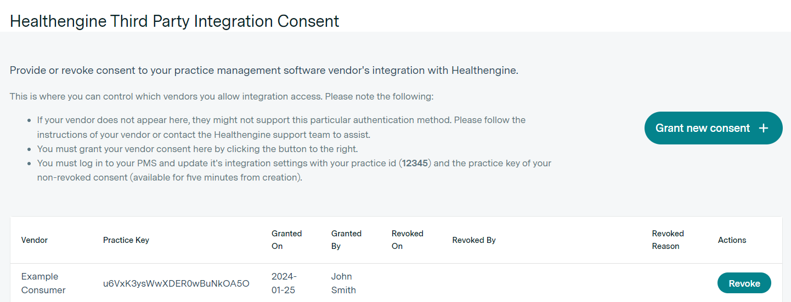

# Quick Start Guide for Healthengine's PMS API

> :warning: **PLEASE NOTE**  
While our PMS API documentation is publicly available, access to it is subject to restrictions and undergoes individual review. Before initiating any development work, please contact us at integrations@healthengine.com.au for further assistance.


## Introduction

This is a quick start guide tailored for PMS vendors or practices interested in publishing available time slots on Healthengine and accepting bookings through the platform.

The guide is intended for software developers responsible for implementing the software integration with Healthengine. As such, it will provide technical insights and instructions.

If you have any questions or require clarification regarding this document, please reach out to the Healthengine Integration Team via integrations@healthengine.com.au

---

## Australian Privacy Laws
To comply with Australian Privacy Principles (or APPs), PMS API consumer processing and storage of data - whether through webhook subscription endpoints receiving data or integration workers retrieving data from our PMS API - must be done within a location in Australia. This ensures adherence to Chapter 8: APP 8 Cross-border disclosure of personal information (https://www.oaic.gov.au/privacy/australian-privacy-principles/australian-privacy-principles-guidelines/chapter-8-app-8-cross-border-disclosure-of-personal-information). As Healthengine does not support cross-border data transfers, all data handling must occur within Australia to remain compliant with Australian Privacy Laws.

---

## The development phase

Throughout the development phase of your integration, we will configure your system as a test PMS API consumer within our infrastructure. Additionally, we will grant access to one or more test practices that have granted their consent to utilise your integration.

These test practices will mimic real-world practices in terms of functionality and behavior but will remain inaccessible through searches or indexing on the primary healthengine.com.au website.

It is highly advisable to regularly consult the [suggested testing document](suggested-testing.md) during the development phase. This will help ensure that your integration design can effectively address the scenarios outlined in the document.

As your development approaches completion, please carefully review the [go-live process section](#the-go-live-process) of this document for detailed steps on transitioning your integration from a test consumer to a production consumer, where it can interact with non-test Healthengine practices.

## Identifying your application

All outgoing requests should include your own custom *User-Agent* in the request header so we can easily identify requests coming from you.

Ideally your *User-Agent* should be in the form: **APP_VENDOR_NAME** (**APP_VENDOR_EMAIL**) **APP_ENVIRONMENT**

**APP_VENDOR_NAME** is the name of your application/PMS and your company.  
**APP_VENDOR_EMAIL** is the best contact email address at your company for a person or team who can resolve technical issues.  
**APP_ENVIRONMENT** is the environment you are calling from (e.g. *DEV*, *UAT*, *PROD*).

## Authentication and practice onboarding

To access this API, authentication is required through an API key header associated with your PMS API consumer account. Additionally, individual consent must be obtained from each practice intending to use the integration.

The API key will be securely provided to you and should be treated as confidential. If there is any suspicion that the key might be compromised, we reserve the right to invalidate it and issue a new one.

All interactions using the API key are conducted over HTTPS for security.

To gain access to a practice's Healthengine profile and data, the practice administrator must grant consent and provide practice ID and practice key to be added in API request header.

This can be accomplished by the practice administrator following these steps:
1. Contacting the Healthengine support team via phone at 1300 377 639 or email at support@healthengine.com.au to enable access to the PMS API
2. Visiting the Healthengine API Consumer Consent page within the [Healthengine Practice Admin](https://healthengine.com.au/appointment/admin) portal
3. Clicking the 'Grant new consent' button and selecting your API consumer as the integration vendor
4. Retrieving the supplied practice ID and practice key on consent grant success



Once consent is granted, you will need to provide a way for the practice to provide you with their Healthengine practice ID and practice key, which you can use to link the practice to a PMS account or location.

---

## Syncing practice configuration

Once a practice has granted you consent and has provided you their practice ID and practice key, some initial configuration must be supplied before attempting to sync available appointments and bookings.

This configuration data should be transmitted when:
1. a Healthengine practice ID is associated with a PMS account or location
2. the integration was disabled in your software via configuration and has now been enabled
3. a user opts to resync their practice configuration via a dedicated action in your software
3. whenever there are updates to the corresponding data within your software while the integration is enabled

### The liveness contract

The supplied liveness contract will provide us the times that we can expect your integration to be responding to any requests created for the practice.

This does not necessarily need to coincide with the practice's regular opening hours, especially if you intend to facilitate bookings during times when the practice is typically closed.

It's essential to note that if a critical request such as availability, booking, or booking updates remains unaddressed for more than ten minutes, we will flag the integration as potentially unhealthy.

Depending on the practice's preference, this could lead to the optional unpublishing of appointments to prevent booking conflicts.

An example liveness contract POST follows.

```
POST https://healthengine.com.au/pms-api/v1/config/livenessContract
 api-key: eyJ0e...
 practice-id: 1234567
 practice-key: t1qKf...
 Content-Type: application/json
```
```json
{
  "liveHours": {
    "monday": [
      {"start": "08:00", "end": "17:00"}
    ],
    "tuesday": [
      {"start": "13:00", "end": "15:00"}
    ],
    "wednesday": [
      {"start": "08:30", "end": "12:30"}
    ],
    "thursday": [
      {"start": "08:45", "end": "12:45"},
      {"start": "13:45", "end": "17:45"}
    ],
    "friday": [
      {"start": "00:00", "end": "12:00"},
      {"start": "12:00", "end": "23:59"}
    ],
    "saturday": [
      {"start": "13:45", "end": "14:45"},
      {"start": "08:01", "end": "17:45"}
    ],
    "sunday": [
      {"start": "09:00", "end": "12:00"},
      {"start": "08:00", "end": "08:59"}
    ],
    "publicHolidays": [
      {"start": "09:00", "end": "12:00"}
    ]
  }
}
```

### PMS resources snapshot

PMS resources are the active, bookable entities related to the integrated PMS account or location within your software. Based on your design, a bookable entity might be a practitioner, nurse, or room.

The snapshot endpoint is designed to upload all PMS resources associated with the integrated account or location. Any PMS resources that were previously transmitted but are now missing will be treated as deleted within the PMS.

An example PMS resources snapshot POST follows.

```
POST https://healthengine.com.au/pms-api/v1/config/pmsResources/snapshot
 api-key: eyJ0e...
 practice-id: 1234567
 practice-key: t1qKf...
 Content-Type: application/json
```
```json
[
  {
    "pmsResourceId": "12345",
    "pmsResourceName": "Doctor Do Good",
    "pmsPractitionerFirstname": "Do",
    "pmsPractitionerLastname": "Good",
    "pmsPractitionerTitle": "Doctor"
  }
]
```

### PMS appointment types snapshot

PMS appointment types are the bookable types for one or more of your PMS resources.

These appointment types can be created in two ways: with no linked pmsResourceId, which makes them available to all PMS resources by default, or they can be linked to a specific PMS resource.

Certain scenarios may require you to create appointment types for only specific PMS resources, rather than all of them. For instance:
- When the appointment type demands a skill or equipment that is not universally accessible across all PMS resources.
- When the appointment duration varies among PMS resources due to differing skill levels or equipment availability.

In such cases, you have the option to create appointment types per individual PMS resource. The pmsResourceId must be unique, so it's advisable to generate a replicable identifier that makes sense within your system.

An example could be using a format like '\<appointment type identifier>:\<resource identifier>' (e.g. '12345:12345' if using ids and 'General Appointment - Doctor Do Good' if using names).

The snapshot endpoint is designed to upload all PMS appointment types associated with the integrated account or location. Any PMS appointment types that were previously transmitted but are now missing will be treated as deleted within the PMS.

An example PMS appointment types snapshot POST follows.

```
POST https://healthengine.com.au/pms-api/v1/config/pmsAppointmentTypes/snapshot
 api-key: eyJ0e...
 practice-id: 1234567
 practice-key: t1qKf...
 Content-Type: application/json
```
```json
[
  {
    "pmsResourceId": "12345",
    "pmsAppointmentTypeId": "G1235",
    "pmsAppointmentTypeName": "General Appointment",
    "pmsAppointmentLength": "30"
  }
]
```

---

## Linking PMS and Healthengine objects

Once the practice configuration has been synced, a practice staff member or Healthengine support team member can link Healthengine and PMS objects via the  [Healthengine Practice Admin](https://healthengine.com.au/appointment/admin) portal.


### Creating Healthengine practitioners

A Healthengine practitioner must be created for each of the PMS resources supplied in the practice configuration step in order for the PMS resource to be bookable on the Healthengine platform.

The following article covers creating Healthengine practitioners in detail.

https://support.healthengine.com.au/hc/en-us/articles/360034802811-Adding-Editing-and-Deleting-Practitioners

Please note this section specifically when adding a practitioner:


A test AHPRA number of 'ABC1234567890' is available for test PMS API consumers (only).

Your supplied PMS resources from the 'syncing practice configuration' section should appear in the 'appointment book' dropdown field.

### Creating Healthengine appointment types

Once a Healthengine practitioner has been created, you have the option to edit their appointment types and introduce new ones.


Your supplied PMS appointment types from the 'syncing practice configuration' section should appear in the 'Linked PMS Appointment' dropdown field for each practitioner appointment type.


The following article covers creating Healthengine appointment types for a practitioner in detail.

https://support.healthengine.com.au/hc/en-us/articles/360027963671-Adding-Editing-and-Removing-Appointment-Types

---

## Syncing PMS resource appointment availability

Once the practice configuration has been synchronised and you have linked your resources and appointment types to Healthengine objects, you can commence the process of synchronising appointment availability for each PMS resource.

Each snapshot you send to us should provide details about the availability of a specific PMS resource for a particular date within the practice's timezone.

Availability can be conveyed as time ranges, such as 9 am to 5 pm, until they are divided by a booking, or as individual appointment slots, each representing the smallest feasible unit of time.

If your software supports it, you have the ability to transmit availability that is exclusive to certain appointment types for a given practitioner using the 'pmsAppointmentTypeIds' field. This feature allows you to accommodate scenarios like Dr. Do Good only conducting patient visits on Tuesdays.

It is important to send availability snapshots as often as possible to avoid availability in Healthengine becoming stale and causing booking failures.

We strongly recommend you send availability in the following situations:
1. when resource availability has been changed in your software
2. when the integration is disabled via configuration in your software and is enabled again
3. when requested by us via the availability snapshot request endpoint
4. periodically **at least** once a day to avoid changes being missed in situations 1-3

An example availability snapshot POST follows.

```
POST https://healthengine.com.au/pms-api/v1/availability/snapshot
 api-key: eyJ0e...
 practice-id: 1234567
 practice-key: t1qKf...
 Content-Type: application/json
```
```json
{
  "date": "2023-10-01",
  "pmsResourceId": "12345",
  "availability": [
    {
      "start": "09:00",
      "end": "12:00",
      "slotLength": "30"
    },
    {
      "start": "13:00",
      "end": "17:00",
      "slotLength": "30"
    },
  ]
}
```

---

## Retrieving incoming requests

Once PMS resource availability has been published to the Healthengine, user interactions with the booking platform trigger the generation of requests, which can be retrieved through the requests endpoint.

All request types that aren't tied to an optional extra feature must be implemented, but the following request types are considered especially important:
- Bookings
- Booking updates (including cancellations)
- Availability requests (when they are considered outdated)

It is crucial to promptly address these types of requests. Failure to do so within ten minutes will result in the integration being classified as unhealthy for the associated practice. In such cases, the practice may choose to hide bookings based on their preferences.

We provide two notification methods for incoming requests that have been generated: webhook subscriptions and polling.

### Webhook subscription method

To help you determine when to call the request endpoints, you can set up webhook subscriptions to notify you about the occurring events.

> :warning: **PLEASE NOTE**  
While this method is useful in reducing the number of calls to maintain a healthy integration, you **must** also implement the polling method and poll the requests endpoint at least once an hour to respond to any missed requests due to transient network issues and the integration being disabled in your software.

An example subscription POST follows.

```
POST https://healthengine.com.au/pms-api/v1/subscription
 api-key: eyJ0e...
 practice-id: 1234567
 practice-key: t1qKf...
 Content-Type: application/json
```
```json
{
  "topic": "requests.bookings",
  "callbackUrl": "http://yoururl.com.au/endpoint/bookings",
  "expireAt": "2024-12-01 00:00:00"
}
```

We recommend setting an expiry date and resubscribing to ensure you don't overlook your subscriptions. It's important to actively manage your subscriptions and remove any that are no longer necessary.

It is possible to subscribe to the following types of requests, or `requests.*` to receive them all to the same endpoint.

| Request type          | Associated target               | Extra feature (if applicable) |
| --------------------- | --------------------------------| ----------------------------- |
| attachDocuments       | /requests/attachDocuments       | attachDocuments               |
| availability          | /requests/availability          |                               |
| availableDocuments    | /requests/availableDocuments    | documents                     |
| bookings              | /requests/bookings              |                               |
| bookingUpdates        | /requests/bookingUpdates        |                               |
| clientSnapshots       | /requests/clientSnapshots       | clientSnapshots               |
| pmsAppointmentChanges | /requests/pmsAppointmentChanges |                               |
| pmsAppointmentTypes   | N/A                             |                               |
| pmsResources          | N/A                             |                               |
| uploadDocuments       | /requests/uploadDocuments       | documents                     |

More information on request types and subscriptions is available in our [API definition](../openapi.yaml).

When an event triggers the generation of a request type, a JSON payload associated with the request will be sent to the callback URL you've provided.

If the request is not responded to within 5 seconds, the attempt will time out. In the event of a timeout, the payload will be resent three times with increasing intervals of 10, 100, and 1000 seconds, using an exponential backoff strategy.

Using the example subscription created earlier, a request will be generated when a user attempts to book a PMS resource availability slot on the Healthengine platform. The following skinny payload is sent with no personally identifiable information.

```json
{
  "timestamp": "2023-12-01 01:13:55",
  "id": "db26bebd-63f3-47d6-9fb8-09b4edc38aa7",
  "clientId": null,
  "topic": "requests.bookings",
  "data": {
    "target": "/requests/bookings",
    "requestType": "bookings",
    "bookingId": 154
  }
}
```

After receiving the event payload you should hit the bookings endpoint.

Go to the [Handling incoming requests](#handling-incoming-requests) section below to see how to do that, but be
aware that you should process all outstanding bookings when you receive a callback as well, not just for the bookingId you have been notified about.

Due to the possibility of an outage it is also recommended that you poll periodically for events, or have a way to trigger an update if for instance you are able to recover your webserver.

If you want to test out the payloads easily you can also use a site like https://webhook.site/ to give you the payload data as it happens and to experiment. No
patient data will be given in the webhooks, so you are safe to use an external site like this.

#### Troubleshooting webhook errors

When working with webhooks, troubleshooting can be challenging when issues arise.

To simplify the troubleshooting process, we offer an endpoint that allows you to access logs related to the webhook call attempts.

An example subscription error log GET follows.

```
GET https://heweb.dev.he0.io/pms-api/v1/subscriptionErrorLog?subscriptionId=db26bebd-63f3-47d6-9fb8-09b4edc38aa7&from=2020-10-12+09%3A
 api-key: eyJ0e...
 practice-id: 1234567
 practice-key: t1qKf...
```

For the best results you can specify from, to, and subscriptionId.

This will give you a result like so:

```json
{
  "data": [
    {
      "timestamp": "2020-10-12 10:08:28",
      "id": "f0fc5931-678a-4152-9b45-710ed6959ae9",
      "subscriptionId": "db26bebd-63f3-47d6-9fb8-09b4edc38aa7",
      "subscriptionTopic": "requests.bookings",
      "clientId": null,
      "callbackUrl": "https:\/\/yourweb.site\/3dfbb04e-ea89-42bc-be90-bb52ab123ec5",
      "payload": {
        "id": "db26bebd-63f3-47d6-9fb8-09b4edc38aa7",
        "data": {
            "target": "/requests/bookings",
            "requestType": "bookings",
            "bookingId": 154
        },
        "topic": "requests.bookings",
        "clientId": null,
        "timestamp": "2020-10-12 10:06:35"
      },
      "attempt": 3,
      "errorType": "GuzzleHttp\\Exception\\ConnectException",
      "errorMessage": "cURL error 6: Could not resolve host: yourweb.site (see https:\/\/curl.haxx.se\/libcurl\/c\/libcurl-errors.html"
    }
  ],
  "page": {
    "currentPage": 1,
    "totalPages": 1,
    "perPage": 100,
    "total": 1
  }
}
```

This feature enables you to identify instances where the webhook has encountered multiple failures. In this particular scenario, it attempted to execute the task three times, and the log provided pertains to the last failed attempt.

### Polling method

This method involves periodically polling our 'requests' endpoint that will then tell you which other request endpoints require resolving.

If you are not also implementing the webhook subscription method, this endpoint should be called at least once every five seconds to ensure that requests are dealt with in a timely fashion.

If you are implementing the webhook subscription method, you should still poll this endpoint at least once an hour. This practice helps in identifying any missed requests caused by transient network issues or the integration being temporarily disabled within your software.

An example requests GET follows.

```
GET https://healthengine.com.au/pms-api/v1/requests
 api-key: eyJ0e...
 practice-id: 1234567
 practice-key: t1qKf...
```

and a result will look like this, indicating to call the /request/bookings endpoint (see [Handling incoming requests](#handling-incoming-requests))

```
[
  "bookings"
]
```

## Handling incoming requests

After determining that we should retrieve booking requests either through polling or webhook payloads, we proceed to access the booking requests endpoint.

```
GET https://healthengine.com.au/pms-api/v1/requests/bookings
 api-key: eyJ0e...
 practice-id: 1234567
 practice-key: t1qKf...
```

It's crucial to process all booking requests prior to handling booking updates. Furthermore, it's essential to ensure that all requests are appropriately addressed, either by confirming or rejecting them.

We confirm the booking by extracting the bookingId from the response and then responding to the bookings endpoint. This action signals to Healthengine that the booking has been successfully inserted into the PMS.

```
POST https://healthengine.com.au/pms-api/v1/bookings/36127212/confirmInsert
 api-key: eyJ0e...
 practice-id: 1234567
 practice-key: t1qKf...
 Content-Type: application/json
```
```json
{
  "pmsAppointmentIds": ["123"],
  "pmsPatientId": "Patient1"
}
```

If you intend to reject the insertion, it's advisable to do so within 20 seconds of the request being generated. This prompt rejection will prompt the patient to rebook, offering them a more seamless experience.

> :warning: **PLEASE NOTE**  
When processing a booking request, you should attempt to match the supplied patient data with an existing patient in your PMS, whether the patient was created through a previous Healthengine booking request or existed prior to the integration. This helps prevent duplication of patient records. For more details, please refer to our [suggested testing document](suggested-testing.md) for the scenarios that should be covered.

As for other request endpoints, you can find detailed documentation for them within the [API definition](../openapi.yaml) itself. It is highly recommended that you thoroughly explore this document for comprehensive information.

---

## The go-live process

Once you have completed your integration development and are ready to proceed, please contact us at integrations@healthengine.com.au to initiate the steps for going live.

The typical process for going live will generally follow these steps:

1. Setting up a test PMS account for our team's access, allowing us to create support documentation and conduct end-to-end testing.
2. Performing end-to-end testing on our end, aligning with the use cases outlined within the [suggested testing document](suggested-testing.md) (optional)
3. Conducting a review of the system's performance under load (optional)
4. Providing you with the Healthengine API license agreement for your review and signature.
5. Supplying production credentials to you through a secure and confidential method.

Please feel free to reach out to us when you are prepared to move forward with these steps.